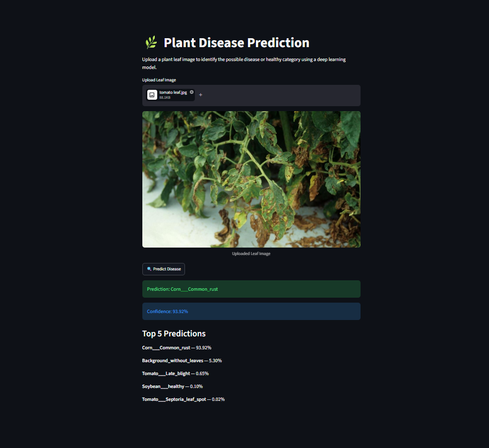

# 🌿 Plant Disease Prediction using Deep Learning

An AI-powered plant disease prediction system that uses deep learning and transfer learning to identify plant diseases from leaf images.

The project uses a pretrained **EfficientNetB4** model with fine-tuning to classify plant leaf images into **39 disease and healthy categories**.

## 🚀 Live Demo

👉 https://suryansh-plant-disease-prediction.streamlit.app/

## 🖥️ Live App Preview



## 📌 Project Overview

Plant diseases can significantly affect crop productivity and agricultural production. This project aims to automate plant disease identification using image classification techniques.

Users can upload a plant leaf image, and the trained deep learning model predicts the corresponding disease or healthy category along with confidence scores.

The model is trained on a large plant leaf image dataset and uses transfer learning with EfficientNetB4 for image classification.

## ✨ Features

- 🌱 Plant disease classification from leaf images
- 🧠 Transfer learning using EfficientNetB4
- 🏷️ Classification across 39 categories
- 🖼️ Image preprocessing and resizing
- 📊 Top-5 prediction confidence scores
- 🔍 Fine-tuned deep learning model
- 🌐 Interactive Streamlit web application
- ⚡ Real-time prediction from uploaded images

## 🛠️ Technologies Used

- Python
- TensorFlow
- Keras
- NumPy
- Matplotlib
- Pillow
- Split-Folders
- Streamlit
- Git & GitHub
- Git LFS

## 🧠 Model Architecture

The project uses **EfficientNetB4** as the feature extraction backbone with a custom classification layer.

```text
Input Image
     ↓
160 × 160 × 3
     ↓
EfficientNetB4
     ↓
Global Average Pooling
     ↓
Dropout (0.2)
     ↓
Dense Layer
     ↓
Softmax
     ↓
39 Classes
